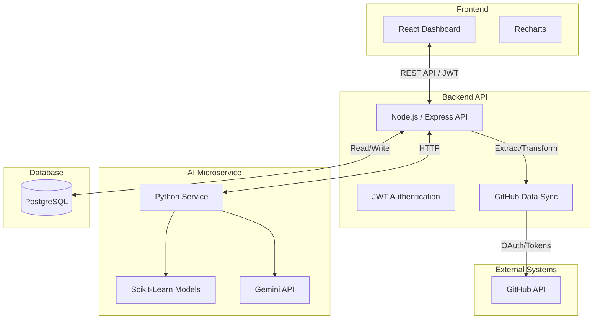

# AgileAI Dashboard Deployment Guide

## System Architecture



## Local Development

1. **Prerequisites:** Docker and Docker Compose installed.
2. **Environment Variables:** Create a `.env` file in the root directory:
   ```env
   GEMINI_API_KEY=your_gemini_api_key
   JWT_SECRET=your_jwt_secret
   ```
3. **Run Services:**
   ```bash
   docker-compose up --build
   ```
4. **Access the App:** Open `http://localhost:3000` in your browser.
   - Demo Credentials: `admin` / `password`

## Production Deployment (e.g., Render, Railway)

### 1. Database Setup
- Provision a managed PostgreSQL database (e.g., Render PostgreSQL, Supabase, or AWS RDS).
- Note the connection string (`DATABASE_URL`).

### 2. AI Microservice Deployment
- Create a new Web Service.
- Connect your repository and select the `Dockerfile.ai` as the build source.
- Add Environment Variables:
  - `GEMINI_API_KEY`

### 3. Backend & Frontend Deployment
- Create a new Web Service.
- Connect your repository and select `Dockerfile.backend` as the build source.
- Add Environment Variables:
  - `NODE_ENV=production`
  - `JWT_SECRET=your_secure_random_string`
  - `GEMINI_API_KEY=your_gemini_api_key`
  - `AI_SERVICE_URL=url_of_deployed_ai_service`
  - `DATABASE_URL=your_postgres_connection_string`

### 4. GitHub Integration Setup
- To use the GitHub sync feature in production, create a [GitHub App](https://docs.github.com/en/apps) or use a Personal Access Token (PAT).
- Ensure the token has `repo` and `read:org` scopes to fetch issues, PRs, and commits.
